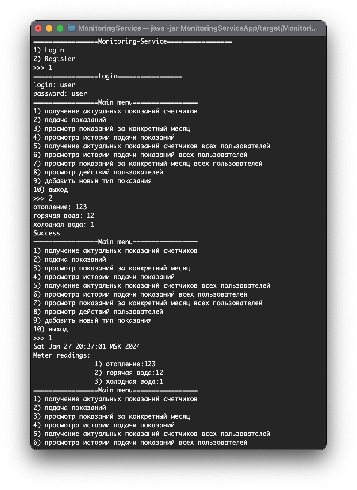
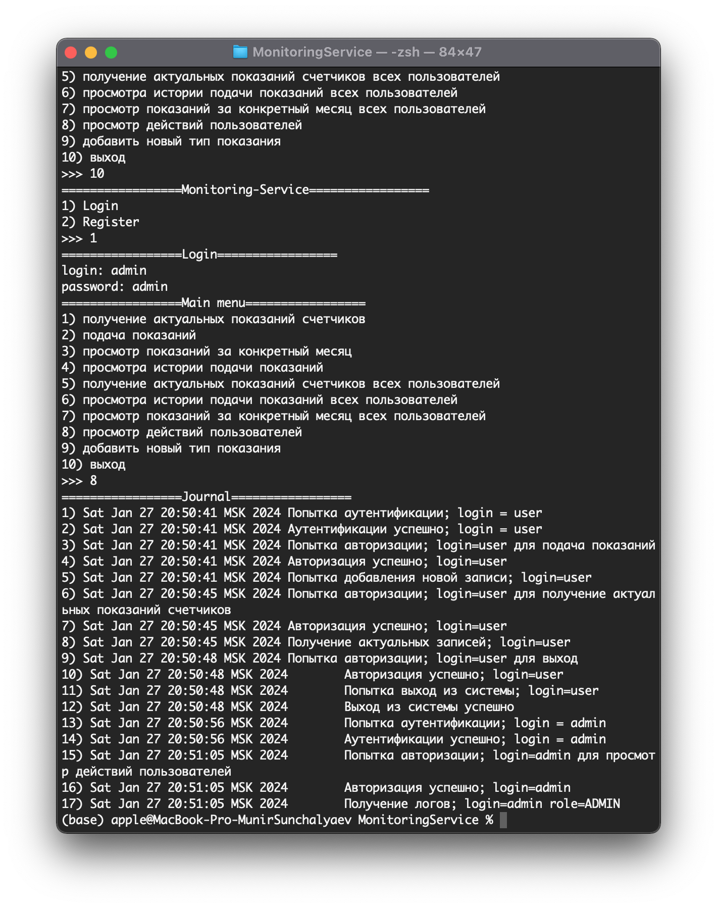

# Monitoring-Service
Консольный сервис для подачи показаний счетчиков отопления, горячей и холодной воды и не только.

## Требования к реализации
Показания можно подавать один раз в месяц.
Ранее поданые показания редактировать запрещено.
Последние поданые показания считаются актуальными.
Пользователь может видеть только свои показания, администратор может видеть показания всех пользователей.

- предусмотреть расширение перечня подаваемых показаний
- данные хранятся в памяти приложения
- приложение должно быть консольным (никаих спрингов, взаимодействий с БД и тд, только java-core и collections)
- регистрация пользователя
- авторизация пользователя
- реализовать эндпоинт для получения актуальных показаний счетчиков
- реализовать эндпоинт подачи показаний
- реализовать эндпоинт просмотра показаний за конкретный месяц
- реализовать эндпоинт просмотра истории подачи показаний
- реализовать контроль прав пользователя
- Аудит действий пользователя (авторизация, завершение работы, подача показаний, получение истории подачи показаний и тд)

## Нефункциональные требования
Unit-тестирование

## Особенности реализации 
Реализация основана на архитектуре MVP: Model сосредоточено в модуле MonitoringServiceBackend,
View - в MonitoringServiceFrontend, Presenter - в MonitoringServicePresenter. Model и View для обмена сообщениями
используют объекты DTO на вход и на выход, расположенные в модуле Commons. Для журналирования действий пользователя
предусмотрена реализация логгера в модуле Logger. Точка входа расположена в MonitoringServiceApp.

Юнит-тесты написаны только для MonitoringServiceBackend и Logger, остальные модули - тестировались вручную.

По умолчанию предопределены два пользователя USER(login=user,password=user) и ADMIN(login=admin,password=admin)
для облегчения тестирования. Что может пользователь с ролью USER:

1) получение актуальных показаний счетчиков
2) подача показаний
3) просмотр показаний за конкретный месяц
4) просмотра истории подачи показаний

Что может пользователь с ролью ADMIN:

1) получение актуальных показаний счетчиков всех пользователей
2) просмотра истории подачи показаний всех пользователей
3) просмотр показаний за конкретный месяц всех пользователей
4) просмотр действий пользователей
5) добавить новый тип показания


## Сборка и запуск проекта
Перейти в корень проекта и собрать проект:

```
mvn clean package
```

Запустить сборку:

```
java -jar MonitoringServiceApp/target/MonitoringService.jar
```

## Примеры запуска
Ввод и получение актуальных данных



Получение журнала администратором:




