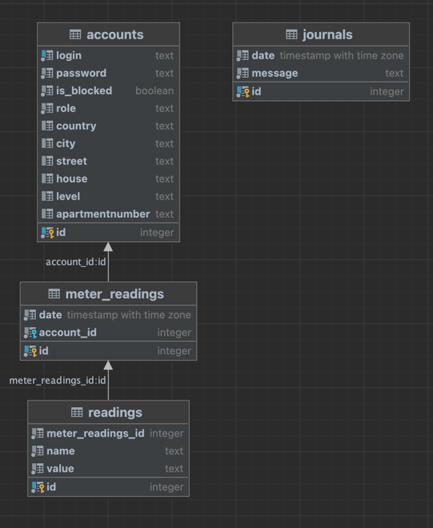
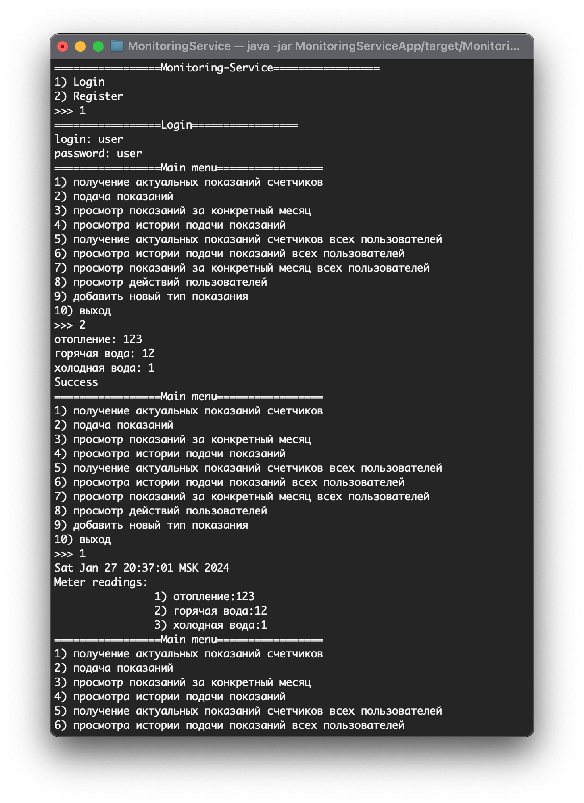
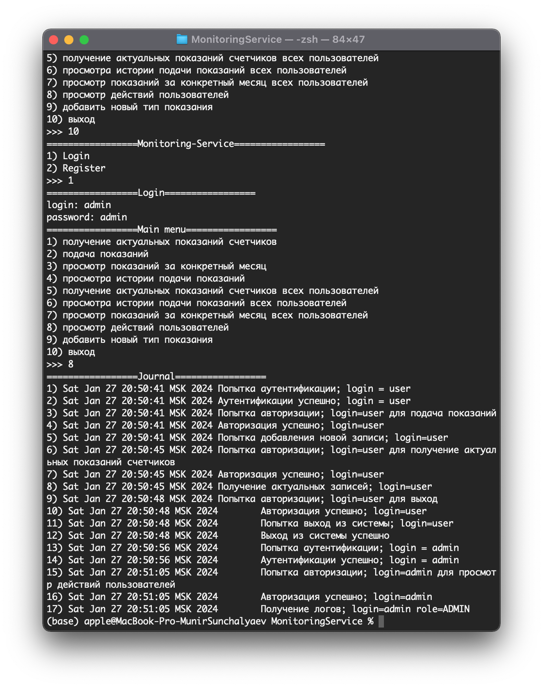

# Monitoring-Service
Необходимо обновить сервис, который вы разработали в первом задании согласно следующим требованиям и ограничениям

## Требования к реализации

- Репозитории теперь должны писать ВСЕ сущности в БД PostgreSQL

- Идентификаторы при сохранении в БД должны выдаваться через sequence

- DDL-скрипты на создание таблиц и скрипты на предзаполнение таблиц должны выполняться только инструментом миграции Liquibase

- Скрипты миграции Luiqbase должны быть написаны в нотации XML или YAML

- Скриптов миграции должно быть несколько. Как минимум один на создание всех таблиц, другой - на предзаполнение данными

- Служебные таблицы должны быть в отдельной схеме

- Таблицы сущностей хранить в схеме public запрещено

- В тестах необходимо использовать test-containers

- В приложении должен быть docker-compose.yml, в котором должны быть прописаны инструкции для развертывания postgre в докере. Логин, пароль и база должны быть отличными от тех, что прописаны в образе по-умолчанию. Приложение должно работать с БД, развернутой в докере с указанными параметрами.

- Приложение должно поддерживать конфиг-файлы. Всё, что относится к подключению БД, а также к миграциям, должно быть сконфигурировано через конфиг-файл.


## Особенности реализации 
Для представления в реляционной БД сущностей были созданы соответствующие таблицы:



Полная схема указана в Commons/resources/db.changelog. Для взаимодействия с базой данных и инициализации
схему созданы соответствующие классы в Commons/java/db. Файлы свойств присутствуют в папке resources.
В процессе запуска схемы инициализируется в точке входа в MonitoringServiceApp в методе main(...).

Изменений коснулись слои repositories в модулях Logger и MonitoringServiceBackend. В частности
появились новые классы для взаимодействия с JDBC - это класс Query, хранящий в себе запросы SQL,
перечисления с именами колонок таблиц с целью дальнейшего преобразования в сущности и подслой
сопоставления для минимизации кода в DAO. Тестирования DAO слоя осуществляется при помощи интеграционных
тестов с применением тест-контейнера, реализованного в классе ../test/java/dao/PostgresContainer.

По умолчанию предопределены два пользователя USER(login=user,password=user) и ADMIN(login=admin,password=admin) для облегчения тестирования. Что может пользователь с ролью USER:

1. получение актуальных показаний счетчиков
2. подача показаний
3. просмотр показаний за конкретный месяц
4. просмотра истории подачи показаний

Что может пользователь с ролью ADMIN:

1. получение актуальных показаний счетчиков всех пользователей
2. просмотра истории подачи показаний всех пользователей
3. просмотр показаний за конкретный месяц всех пользователей
4. просмотр действий пользователей
5. добавить новый тип показания

## Сборка и запуск проекта
Убедиться, что Docker-daemon присутствует в системе. Перейти в корень и собрать проект:

```
mvn clean package
```

или запуск без прогона интеграционных тестов

```
mvn clean package -DskipTests=true
```
Запустить Postgres:

```
docker compose up -d
```

Запустить сборку:

```
java -jar MonitoringServiceApp/target/MonitoringService.jar
```

## Примеры запуска
Ввод и получение актуальных данных



Получение журнала администратором:

